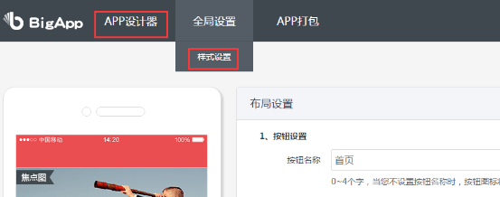

# 开源目的

通过使用该源码，开发者可以迅速地将Discuz论坛迁移到Android客户端中。不需要任何的开发工作即可拥有属于自己论坛的Android客户端

# 准备工作

在使用源码之前必须先在Discuz论坛中安装BigApp插件。

#### 一、插件安装

应用中心 -> 插件 -> 搜索bigapp -> 点击BigApp手机客户端 -> 安装应用即可

安装步骤参考 [Bigapp安装方法](http://addon.discuz.com/?@bigapp.plugin.doc/install_step)

#### 二、配置插件

1、登录注册模式（原生登录、web登录、原生注册、web注册、允许客户端更换头像）

2、第三方登录开关（QQ登录、微信登录开关）

3、签到设置（APP签到设置）

4、高级DIY设置如下（APP设计器、样式设置）, 如图：

> 注：如下配置将不可用（站长认证、生成App、布局设置、推送设置、统计分析）, 如图：
> 

# 使用说明

> 注：请使用Android Studio开发工具，gralde脚本编译

> 注：本源码中不包含消息推送和版本更新功能。

1、使用Android Studio导入项目

2、在项目中找到 Clan\Clan\res\values\strings_config.xml文件，并进行配置

> 配置项说明如下：

    <!-- 是否启用分享功能，1代表启用，其它代表不启用 -->
    <string name="is_use_share">1</string>
    <!-- 具体是否启用微信、qq、微博分享，1或use_xx_ok代表使用，其它代表不使用-->
    <string name="use_wechat">use_wechat_ok</string>
    <string name="use_qq">use_qq_ok</string>
    <string name="use_weibo">use_weibo_ok</string>
    
    <!-- app 主题风格 1.tab风格，2.侧边栏风格，3.类QQ侧边栏风格，4.抽屉菜单风格, 99.QQ空间风格-->
    <string name="custom_theme">1</string>
    
    <!-- api地址 ：您的站点地址 + api/mobile/iyz_index.php-->
    <string name="api_url">http://bbs.bigappdemo.com/api/mobile/iyz_index.php</string>
    <string name="api_url_base">http://bbs.bigappdemo.com/</string>
    <string name="api_url_path">api/mobile/iyz_index.php</string>
  
> 注：对于新浪、微信、QQ的应用信息设置，如果没有使用相关平台功能，可以不进行设置。
  
3、在项目中找到 libs\ShareSDK\assets\ShareSDK.xml文件，设置分享相关的key。

> 本app使用的是sharesdk第三方分享，请拷贝QQ、sina、微信开发者平台的key到此文件中。

4、编译运行应用。
